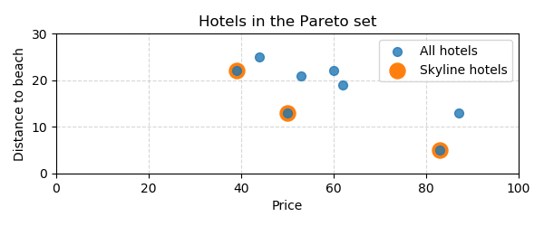
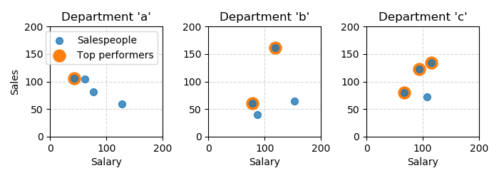
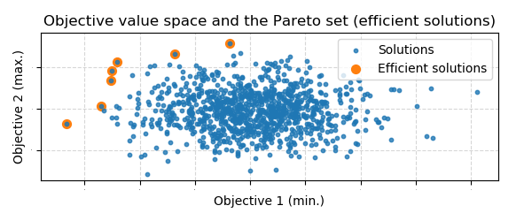

# skyline [](https://travis-ci.com/tommyod/skyline) [](https://pypi.org/project/skyline/)[](https://pepy.tech/project/skyline) [](https://github.com/ambv/black)

Skyline operator/query for computing the Pareto (non-dominated) frontier.

There are two common ways to optimize a function of several variables: 

- **Scalarization** combines the variables using a weighted sum: this gives a linear ordering and *single a minimum value*.
- **Skyline query** returns the Pareto (non-dominated) frontier: his gives a partial ordering and *a set of minimal values*.

The disadvantage of scalarization is that objectives must be weighted beforehand.
The skyline query returns every value that could be obtained by scalarization, but also values that could not have been found by scalarization.

## Examples - Skyline queries for data analysis and insight

The folllowing example is from the paper "*The Skyline Operator*" by Börzsönyi et al.

Suppose you are going on holiday and you are looking for a hotel that is cheap and close to the beach. 
These two goals are complementary as the hotels near the beach tend to be more expensive. 

>The database system at your travel agents' is unable to decide which hotel is best for you, but it can at least present you all interesting hotels. 
Interesting are all hotels that are not worse than any other hotel in both dimensions. 
We call this set of interesting hotels the *skyline*. 
From the skyline, you can now your final decision, thereby weighing your personal preferences for price and distance to the beach.

```python
from skyline import skyline
import pandas as pd

hotels = pd.DataFrame({"price": [50, 53, 62, 87, 83, 39, 60, 44], 
                       "distance_to_beach": [13, 21, 19, 13, 5, 22, 22, 25]})
mask = skyline(hotels, sense=["min", "min"])
skyline_hotels = hotels[mask]
```



Suppose you wish to query a database for salespeople that might be eligible for a raise.
To find top performers (low salary, but high sales) for every department:

```python
from skyline import skyline
import pandas as pd

salespeople = pd.DataFrame(
    {
        "salary": [94, 107, 67, 87, 153, 62, 43, 115, 78, 77, 119, 127],
        "sales": [123, 72, 80, 40, 64, 104, 106, 135, 61, 81, 162, 60],
        "department": ["c", "c", "c", "b", "b", "a", "a", "c", "b", "a", "b", "a"],
    }
)
mask = skyline(salespeople, sense=["min", "max", "diff"])
top_performers = salespeople[mask]
```



## Examples - Pareto efficient solutions (non-dominated front) in multiobjective optimization

Suppose you wish to query a database for salespeople that might be eligible for a raise.
To find top performers (low salary, but high sales) for every department:

```python
from skyline import skyline
import numpy as np
from collections import namedtuple

np.random.seed(42)

# Create Solution objects holding the problem solution and objective values
Solution = namedtuple("Solution", ["solution", "objective_values"])
solutions = [Solution(solution=object, objective_values=np.random.randn(2)) for _ in range(999)]

# Create an array of shape (solutions, objectives) and compute the non-dominated set
objective_values_array = np.vstack([s.objective_values for s in solutions])
mask = skyline(objective_values_array, sense=[min, min])

# Filter the list of solutions, keeping only the non-dominated solutions
efficient_solutions = [solution for (solution, m) in zip(solutions, mask) if m]
```



## Installation

The software is available through GitHub, and through [PyPI](https://pypi.org/project/skyline/).
You may install the software using `pip`.

```bash
pip install skyline
```

## Contributing

You are very welcome to scrutinize the code and make pull requests if you have suggestions and improvements.
Your submitted code must be PEP8 compliant, and all tests must pass.

## Performance

